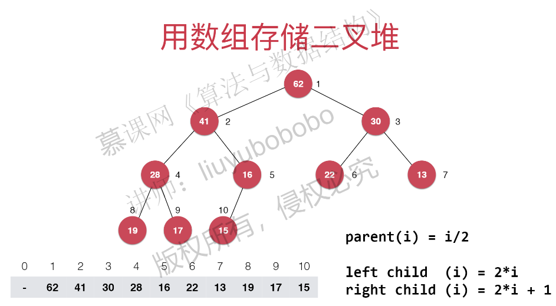

## 堆和优先队列 Heap And Priority Queue

### 优先队列
+ 普通队列
> 先进先出，后进后出
+ 优先队列
> 出队顺序和入队顺序无关，和优先级相关

### 为什么使用优先队列？
> 在1000000个元素当中取出前100个，类似于在N个元素中选取前M个元素
+ 排序 NlogN
+ 优先队列 NlogM
当N越大时，两个的差别越大。

### 优先队列的实现方式

|          |  出队  |  入队  |
| :------: | :----: | :----: |
| 普通数组 |  O(1)  |  o(n)  |
| 顺序数组 |  O(n)  |  O(1)  |
|    堆    | O(lgn) | O(lgn) |

在上述情况当中使用数组，最坏情况O(n²),使用堆最坏情况O(nlgn)

### 堆(二叉堆)
+ 二叉堆(`Binary Heap`)是一棵完全二叉树(二叉堆)
+ 堆中的每个结点总是不大于其父节点的值，
> 如果当前节点为i,则父节点`parent(i) = i/2,left-child = 2*i  right-child = 2*i+1`

#### Shift Up

新插入的元素在数组末尾count+1,为了保证数组永远都是一个完全二叉树，同时满足当前节点永远不大于父节点的值，那么就需要将新增节点的值和父节点进行比较，
如果父节点小于当前节点(data[i/2]<data[i]),则需要父节点和当前节点调换位置(i=i/2),然后继续判断当前节点和父节点的值。同时需要满足(i>1),
因为数组根节点从1开始(0号索引舍弃不用，这就是为什么添加元素时，索引为count+1的原因)。 

#### Shift Down

+ 由于数组已经是二叉树，直接取出根节点data[1]
+ 然后将根节点和最末尾结点进行交换顺序，count--，以便在数组中去除根节点
+ 当前新的根节点依次和子节点进行比较，以满足(`堆中的每个结点总是不大于其父节点的值`)
    - `2*i<=count` 判断当前节点i是否有左节点(如果没有左节点就代表没有节点)
    - `j=2*i`
    - `j+1<=count && data[j]<data[j+1]` 当前节点存在右节点，并且右节点的值大于左节点,那么`j++`
    - `swap(i,j)` 交换子节点和父节点的值,总保证data[j]是data[j]和data[j+1]当中最大的那一个
    - `i=j` 循环继续，将元素继续往下比较